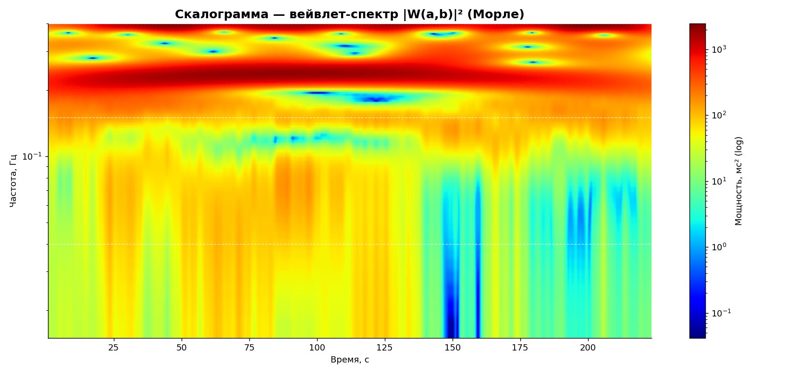
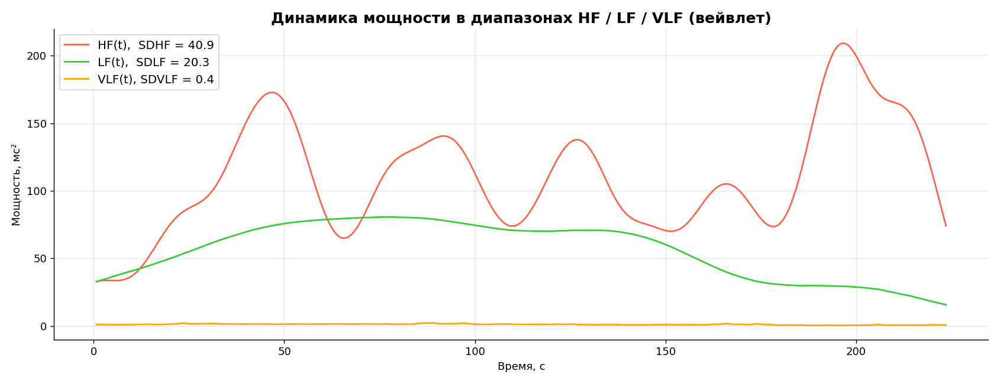
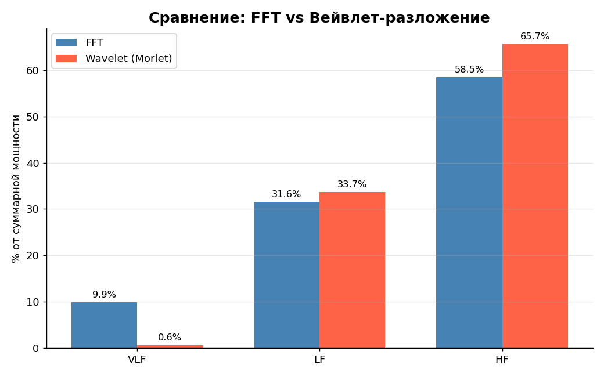

# HRV Wavelet Analysis

Wavelet-based heart rate variability (HRV) analysis in Python.
Unlike FFT, the wavelet transform provides a **time-frequency** representation:
you can track how power in HF / LF / VLF evolves over time.

[Русская версия](README.md)

## What is inside

| Section | Topic |
|---|---|
| 1 | Signal preparation: cubic spline interpolation of RR → 4 Hz |
| 2 | CWT (Morlet): forward transform, W(a, b) matrix |
| 3 | Scaleogram \|W(a, b)\|² on log-frequency scale |
| 4 | Power dynamics: HF(t), LF(t), VLF(t) |
| 5 | Integral metrics: HF, LF, VLF, TP, % normalization, LF/HF |
| 6 | SDHF, SDLF, SDVLF, SDTP — temporal variability of regulatory loops |
| 7 | FFT vs Wavelet comparison |
| 8 | Comparison of different wavelet bases (Morlet, Gaussian) |

## Why this matters for wearables

Wrist HRV is a **non-stationary** signal. Classical FFT averages everything into a
single estimate, losing information about short-lived events (stress episodes,
ectopic beats, transients). CWT preserves time localization: critical for
continuous functional-state monitoring.

A bonus — **SDHF, SDLF, SDVLF** quantify the temporal variability of regulatory
loops, which classical FFT cannot provide.

## Stack

NumPy, SciPy (`CubicSpline`), pandas, matplotlib, **PyWavelets** (`pywt`).

## Demo data results

| Metric | Wavelet | FFT |
|---|---|---|
| HF, % | 65.7 | 58.5 |
| LF, % | 33.7 | 31.6 |
| VLF, % | 0.6 | 9.9 |
| LF/HF | 0.51 | — |
| SDHF | 40.94 | — |
| SDLF | 20.34 | — |
| SDVLF | 0.38 | — |





## How to run

```bash
git clone https://github.com/<username>/hrv-wavelet-analysis.git
cd hrv-wavelet-analysis
pip install -r requirements.txt
jupyter notebook hrv_wavelet.ipynb
```

## Structure

```
hrv-wavelet-analysis/
├── hrv_wavelet.ipynb       # main notebook
├── data/
│   └── rr_intervals.csv    # sample (same as hrv-analysis)
├── figures/                # figures saved by the notebook
├── requirements.txt
├── README.md / README_EN.md
└── LICENSE
```

## Related

- [hrv-analysis](https://github.com/anbix/hrv-analysis) — statistics, geometric, FFT, PARS.
- hrv-nonlinear-dynamics — Hurst, DFA (in progress).

## References

- Mallat S. *A Wavelet Tour of Signal Processing*. Academic Press, 1999.
- Akay M. *Time Frequency and Wavelets in Biomedical Signal Processing*. IEEE Press, 1998.
- Pichot V. et al. (1999). Wavelet transform to quantify HRV: a study in athletes. *Eur J Appl Physiol*.

## Author

Anastasiia Birdina · birdinanastia@gmail.com

## License

MIT — see [LICENSE](LICENSE).
